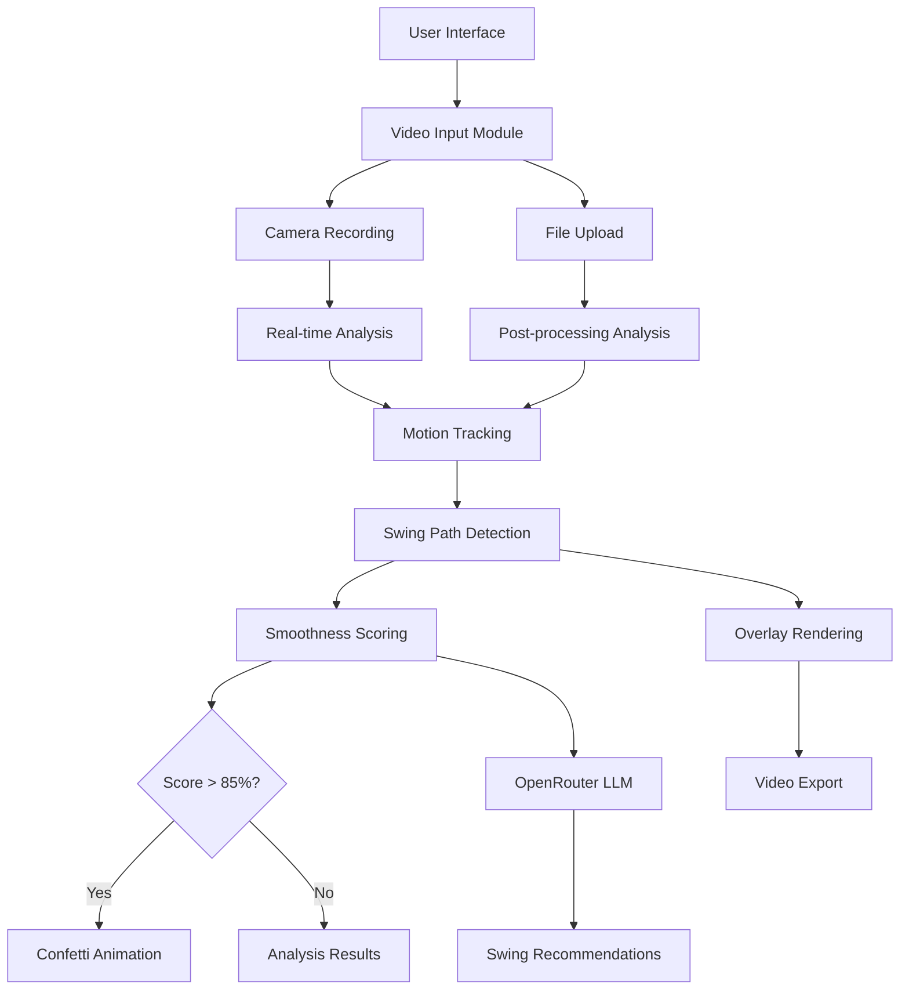

# Golf Swing Analysis App - Technical Architecture

## Overview
A React Router v7 application that allows users to record or upload golf swing videos, analyzes swing mechanics using computer vision, and provides AI-powered recommendations with celebratory feedback for smooth swings.

## Core Technology Stack
- **Frontend**: React Router v7 + TypeScript + Tailwind CSS
- **Video Processing**: HTML5 Canvas + WebRTC + MediaRecorder API
- **Computer Vision**: TensorFlow.js for pose detection and motion tracking
- **AI Analysis**: OpenRouter API with free LLM models
- **Deployment**: Netlify with serverless functions
- **State Management**: React hooks + Context API

## System Architecture



## Key Components Architecture

### 1. Video Processing Pipeline
```typescript
interface SwingAnalysis {
  smoothnessScore: number;
  swingPath: Point[];
  tempo: number;
  recommendations: string[];
  celebrationTriggered: boolean;
}

interface Point {
  x: number;
  y: number;
  timestamp: number;
}
```

### 2. Real-time vs Post-processing
- **Real-time**: Basic pose detection + live path preview
- **Post-processing**: Detailed analysis + LLM recommendations + final overlay

### 3. Mobile-First Design System
- Golf-themed color palette (greens, whites, earth tones)
- Touch-optimized controls
- Responsive video player
- Progressive Web App capabilities

## Technical Implementation Strategy

### Phase 1: Foundation (Tasks 1-2)
- Set up dependencies: TensorFlow.js, canvas libraries, video processing tools
- Create design system with golf theme
- Build core UI components

### Phase 2: Video Handling (Tasks 3-4)
- Implement WebRTC camera access
- Build file upload with format validation
- Create video preview components

### Phase 3: Motion Analysis (Tasks 5-8)
- Integrate pose detection models
- Develop swing path tracking algorithms
- Build smoothness scoring system
- Create real-time overlay system

### Phase 4: AI Integration (Tasks 9-10)
- Connect OpenRouter API
- Implement swing analysis prompts
- Build confetti animation system
- Create celebration triggers

### Phase 5: Export & Polish (Tasks 11-17)
- Video download with overlays
- Mobile optimization
- Error handling
- Performance testing
- Deployment setup

## Key Technical Challenges & Solutions

1. **Real-time Performance**: Use Web Workers for heavy computations
2. **Mobile Video Processing**: Optimize for mobile GPU limitations
3. **Cross-browser Compatibility**: Polyfills for MediaRecorder API
4. **File Size Management**: Video compression and quality controls
5. **Offline Capability**: Service worker for core functionality

## Security & Privacy Considerations
- Client-side video processing (no server uploads)
- Secure API key management via Netlify environment variables
- User consent for camera access
- Local storage for swing history

## File Structure
```
app/
├── components/
│   ├── ui/           # Reusable UI components
│   ├── video/        # Video recording/upload components
│   ├── analysis/     # Swing analysis components
│   └── animations/   # Confetti and other animations
├── lib/
│   ├── video-processing/  # Video analysis utilities
│   ├── ai/               # OpenRouter integration
│   └── utils/            # General utilities
├── routes/
│   ├── home.tsx          # Main app interface
│   ├── analyze.tsx       # Analysis results page
│   └── history.tsx       # Swing history page
└── styles/
    └── golf-theme.css    # Golf-specific styling
```

## Environment Variables
```
OPENROUTER_API_KEY=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
VITE_APP_NAME=Golf Swing Analyzer
```

## Performance Targets
- First Contentful Paint: < 2s
- Video processing: < 5s for 30s clips
- Real-time analysis: 30fps minimum
- Mobile compatibility: iOS Safari 14+, Chrome 90+